Park It
=============================

Description
------------

An android application which helps users find nearby parking space based on their current location. This app will also book a slot in the parking space if needed. Bills will also be generated through this app. Parking space owners will be able to monitor their parking slots. All the booking details can be viewed by both users and parking space owners.

- Project Goals: 

  * Our application aims at helping users to find the most suitable parking space.
  * It enables parking owners to define and manage parking spaces and authenticate users against their reservations when users enter the parking area.
  * This application shows the number of parking areas available near the user's current location along with its free slots status.
  * Users will be able to book a parking slot.
  * The app will be able to generate bills for parking.
  * The users will be able to find parking areas easily, it will save a lot of fuel for them. It also reduces the chances of them being fined. This app will help car parking owners bring in more customers for them.

- Platform: 
 * Language: Java
 * Database: Firebase (Authentication and Real-time Database)
 * IDE: Android Studio

Future Implementations
---------------

- Adding security checks during owner registration
- Review parking spaces

ScreenShots
---------------

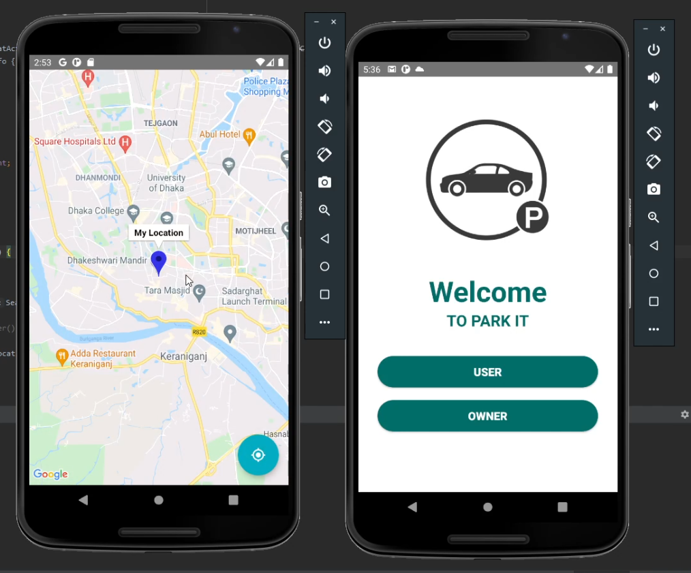

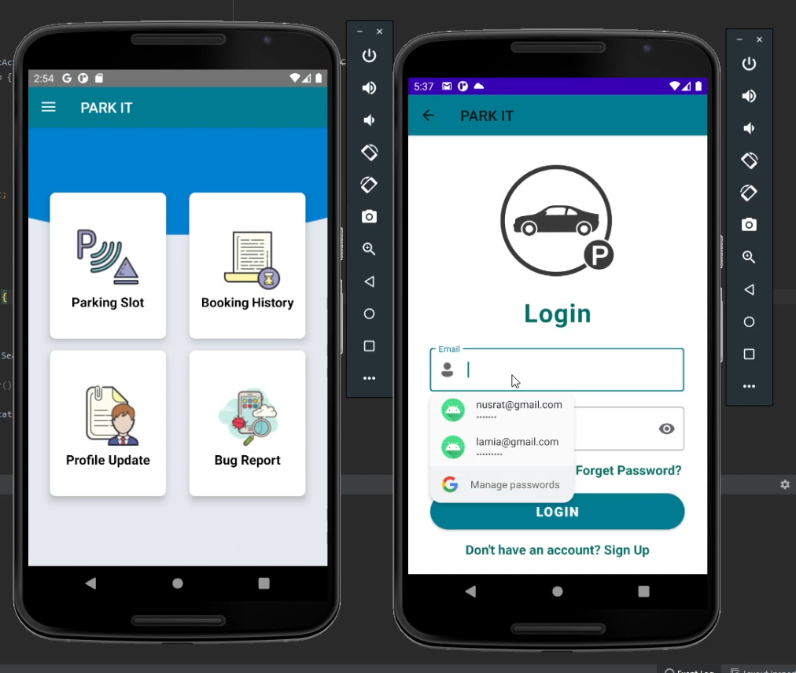

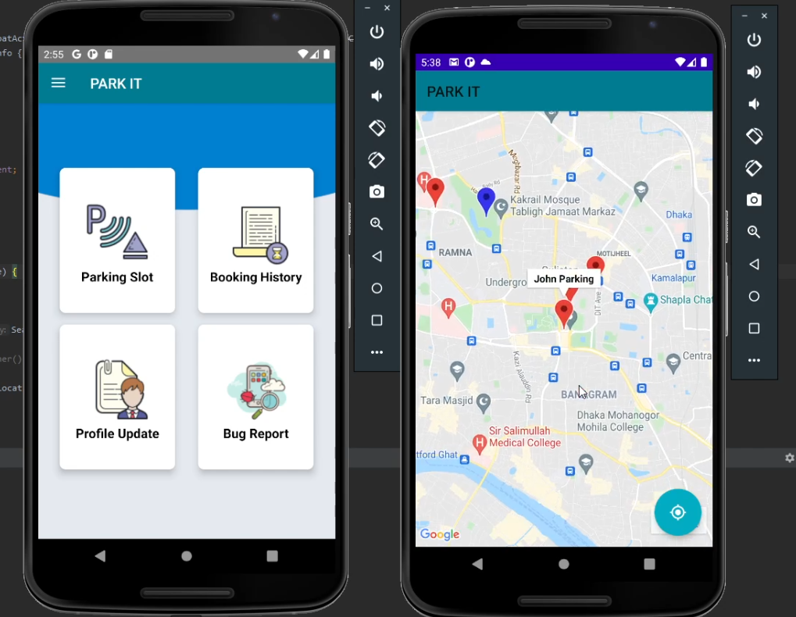
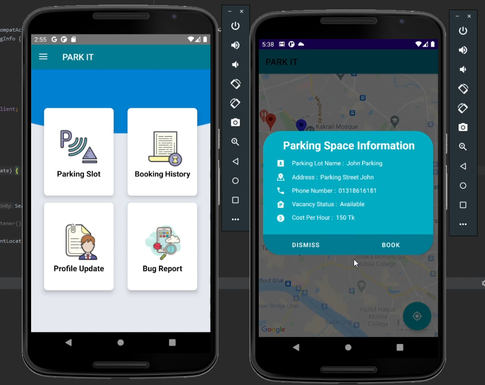
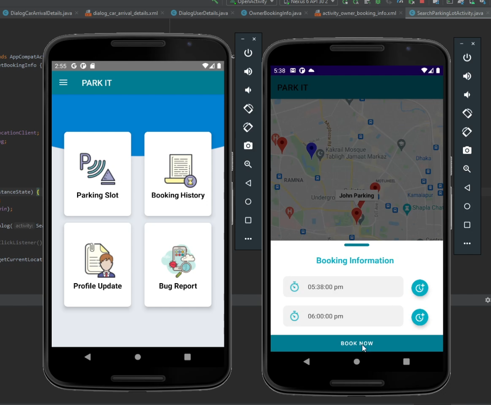
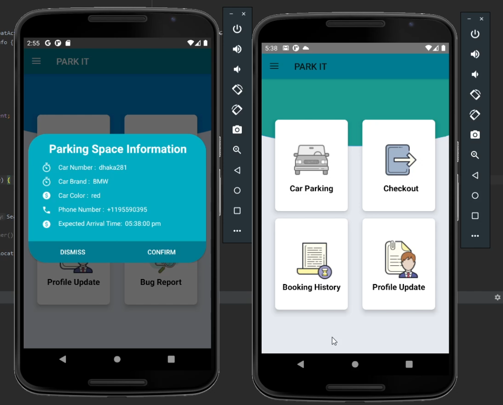
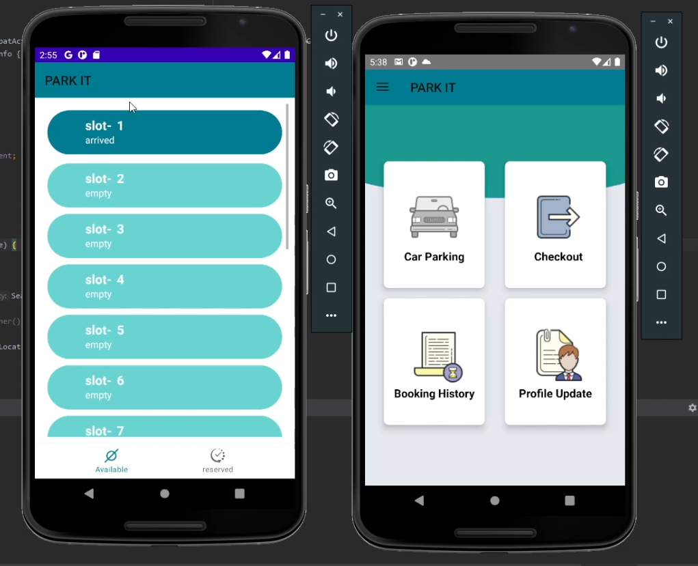
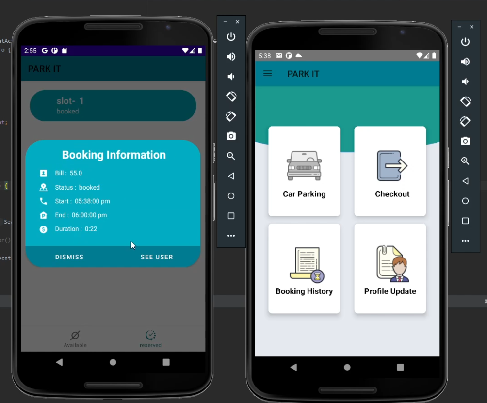
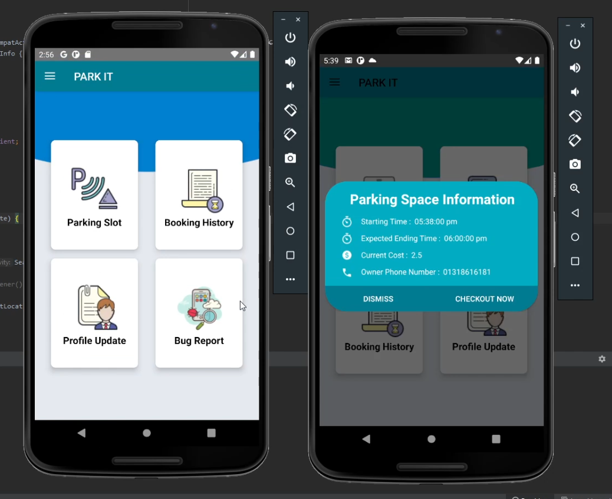
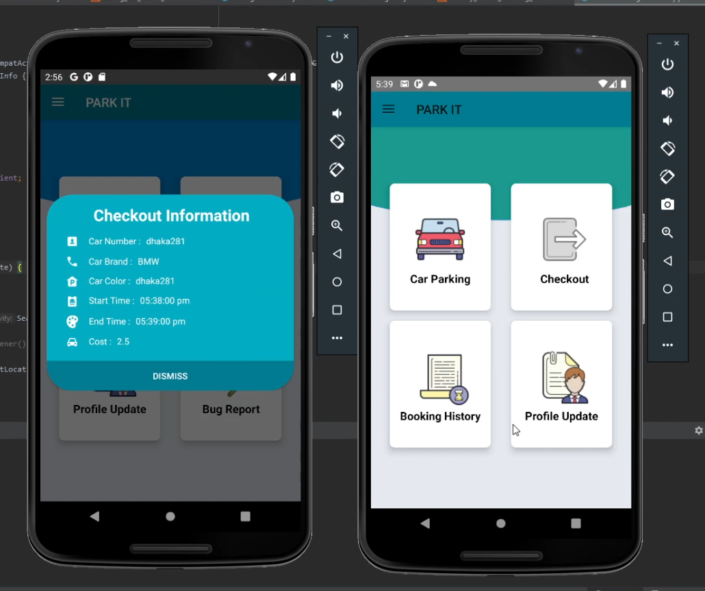
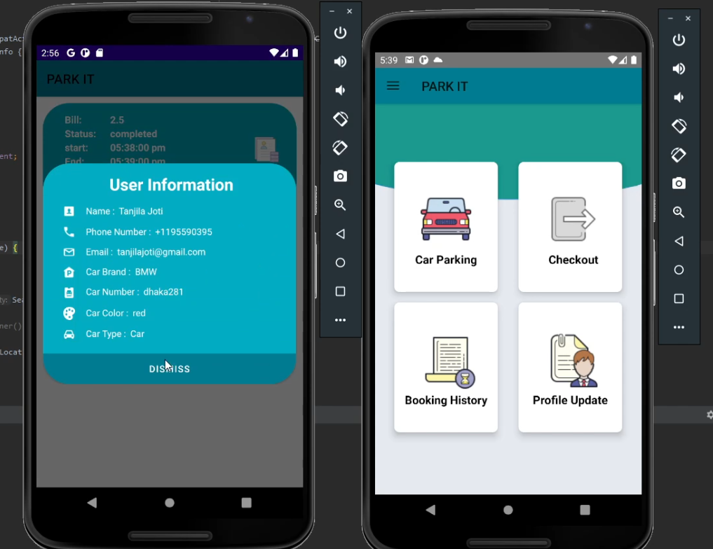

